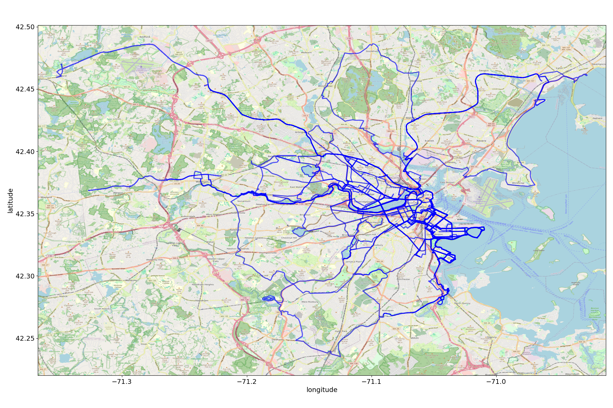

This is an example `systemd` service and Python program for automatically
copying `.FIT` files from a Garmin smartwatch, then drawing the recorded GPS
tracks over corresponding map tile from OpenStreetMap.

**NOTE**: This configuration assumes that you have exactly one Garmin
smartwatch device, that it is mounted to the same location every time, and
that `systemd` is responsible for mounts on the system. It also assumes the
presence of Python 3.9 or higher and the dependencies listed in
`requirements.txt`.

## Example output

## Usage

To use this service for your own system/device:

* rename `path-to-GARMIN.mount.d` to correpond to the path your device is
  mounted on your own system (for me, this was `/media/$USER/GARMIN`),
  replacing slashes with hyphens (keep the `.mount.d` part).

* Edit `garmin-sync.service` and `garmin_sync.py` filling in the `TODO`s with
  the necessary details.

* Copy the renamed `.mount.d` directory to `/etc/systemd/system/`, and install
  the edited `garmin-sync.service`
