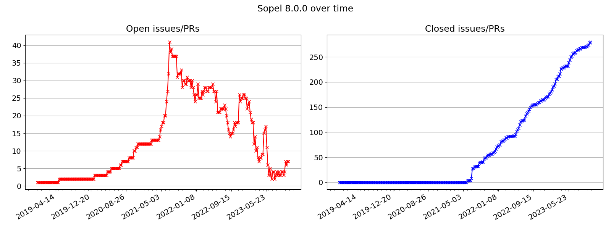

This is a little experiment in visualizing a GitHub milestone over time, more
specifically the [Sopel 8.0.0](https://github.com/sopel-irc/sopel/milestone/15)
milestone.

`query.py` contains the code necessary to query the [GitHub GraphQL API](https://docs.github.com/graphql)
to obtain information about issues and PRs associated with the target milestone
**(NOTE: if you want to re-run this code, you need to edit the file and fill in the API key)**

`analyze.py` contains the code necessary to turn the data returned from this
query into the plot below, counting up the number of open/closed issues at each
time-point in the range to be plotted

