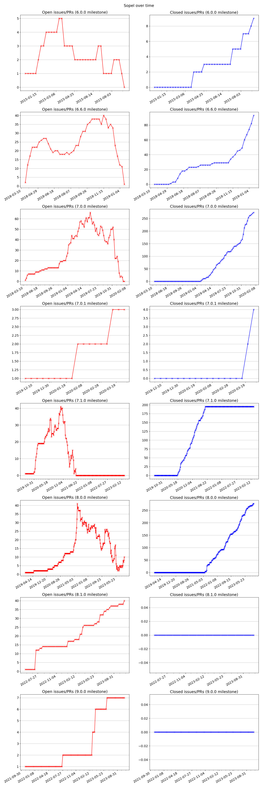

This is a little experiment in visualizing GitHub milestones over time, more
specifically milestones in the project [Sopel](https://github.com/sopel-irc/sopel/milestone/15).

`query.py` contains the code necessary to query the [GitHub GraphQL API](https://docs.github.com/graphql)
to obtain information about issues and PRs associated with the target milestone
**(NOTE: if you want to re-run this code, you need to set the `GITHUB_TOKEN` environment variable)**

`analyze.py` contains the code necessary to turn the data returned from this
query into the plot below, counting up the number of open/closed issues at each
time-point in the range to be plotted

