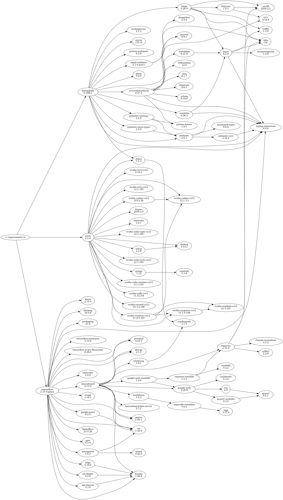

This sample shows off parsing a [requirements file](https://pip.pypa.io/en/stable/reference/requirements-file-format/)
generated by [`pip-compile`](https://pip-tools.readthedocs.io/en/stable/) and rendering the dependency graph using
[Graphviz](https://graphviz.org/)

## Usage

First, install the dependencies (you may want to create and activate a venv first)

```
$ python3 -m pip install -r requirements.txt  # install dependencies
```

Then, either run the `Makefile`

```
$ make
Rendered graphviz to 'out.gv.png'
```

or run `render_requirements.py` directly on an output file of your preference:

```
$ python3 render_requirements.py target-requirements.txt
Rendered graphviz to 'out.gv.png'
```

See `python3 render_requirements.py --help` for some additional options like changing the Graphviz format and output prefix

## Sample output


